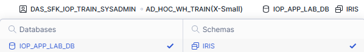

# Environment Setup

Before loading data or running queries, we need to confirm our session context.

Snowflake operations are controlled by:

- Role
- Warehouse
- Database
- Schema

If these are not set correctly, queries may fail.

The quickest way to set up our session context is to open a new SQL file.

In the top left corner of the navigation pane click **`+`** and select **`SQL File`**.

This should open a new file called **`Untitled1.sql`**

---

### Option A - Set Context Using User Interface

## Set Context Using the UI

<table>
  <tr>
    <td align="center">
      <strong>Change Role & Warehouse</strong><br><br>
      
    </td>
    <td align="center">
      <strong>Change Database & Schema</strong><br><br>
      
    </td>
  </tr>
</table>

---
## Option B – Set Context Using SQL

Copy and paste the the following SQL statement in the the SQL file and click the ▶️ button.

```sql
USE ROLE DAS_SFK_IOP_TRAIN_APPLAB_USERS;
USE DATABASE IOP_APP_LAB_DB;
USE WAREHOUSE AD_HOC_WH_TRAIN;
```
Confirm your context by copying and pasting the the following SQL statement under the previous SQL and click the ▶️ button again.
```sql
SELECT
    CURRENT_USER(),
    CURRENT_ROLE(),
    CURRENT_DATABASE(),
    CURRENT_WAREHOUSE();
```