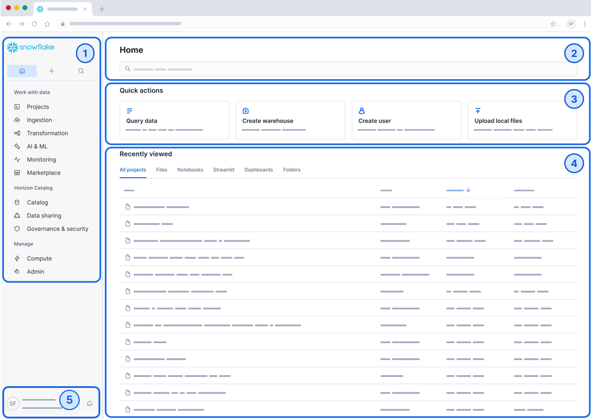

# Snowsight Interface

  
<strong>Snowsight Home Overview</strong>

  

    
  

# 1. Navigation Menu
- Selections for creating and managing data products, notebooks, worksheets, databases, and related artifacts.
- Provides access to Projects, Data, Compute, Governance, and Marketplace features.
- Primary starting point for most development and administrative activities.

## Navigation Menu Breakdown

The navigation menu organizes Snowsight into the following functional areas.

---

### Work with Data

- **Projects**  
  Analyze data and develop applications using Worksheets, Notebooks, Streamlit, Dashboards, and Native Apps.

- **Ingestion**  
  Use connectors and tools to ingest data into Snowflake.

- **Transformation**  
  Monitor and manage data transformation jobs and pipelines using dynamic tables and tasks.

- **AI & ML**  
  Use Snowflake Cortex AI and Snowflake ML to analyze unstructured data and build intelligent applications.

- **Monitoring**  
  Review query history, job history, container services, logs, and traces.

- **Marketplace**  
  Discover third-party data, applications, and products.

---

### Horizon Catalog

- **Catalog**  
  Browse all databases, data products, and shared assets in one place.

- **Data Sharing**  
  Publish internally, share privately, or distribute via Snowflake Marketplace.

- **Governance & Security**  
  Manage permissions, monitor access, and enforce security policies.

---

### Manage

- **Compute**  
  Manage warehouses and compute pools.

- **Admin**  
  Administer accounts, billing, integrations, and administrative settings.

---

# 2. Search
- Easily discover data products and database objects.
- Search for tables, views, functions, schemas, and other objects.
- Quickly navigate to objects without browsing the full hierarchy.

---

# 3. Quick Actions
- Perform operations specific to your current role.
- Create worksheets, notebooks, or dashboards.
- Upload files directly to tables.

---
# 4. Recently Viewed

- Displays recent worksheets, notebooks, dashboards, and projects.
- Provides quick return access to recent work.
- Organized into tabs for different object types.

---

# Account Preferences

Account Preferences allow you to configure your personal Snowsight experience.

To access:
1. Click your profile icon in the bottom-left corner.
2. Select **Settings** => **Preferences** 

You can configure:

- **Theme** – Light, Dark, or System.
- **Language** – Display language for Snowsight.
- **Default Role & Warehouse** – Sets the default context when opening worksheets and dashboards.
