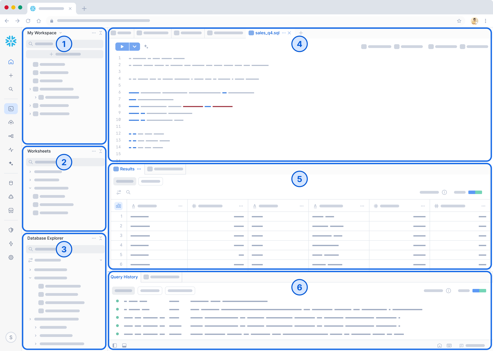

← [Loading Data](load_data.md) || [SQL Worksheet](sql_worksheet.md) →

# Workspaces

Workspaces provides a unified editor for creating, organizing, and managing code across multiple file types that you can use to analyze data, develop models, and build pipelines.  A workspace is private to you and offers a development environment where you can build, experiment, and test your work. 

  
<strong>Workspace Interface Overview</strong>

  

    
  

---

## 1. Workspaces

- Central location for your files and folders.
- Drag and drop files between folders.
- Use nested folders to organize related worksheets.
- Each user has a default workspace named **My Workspace**.
- You can create additional workspaces using **+ Add New**.
- The default workspace cannot be renamed or deleted.

---

## 2. Worksheets

- Open and edit worksheets you own or have permission to access.
- Changes will not save if you only have view-only permissions.
- Convert a worksheet into a workspace file by dragging it into a folder.
- Workspace queries behave like worksheets with:
  - Improved UI performance
  - Ability to run two queries simultaneously from the same SQL file

---

## 3. Database Explorer

- Hierarchical view of all databases and objects in your account.
- Organized by database → schema → object type.
- Use the filter to quickly locate objects.
- Select **Show databases I can query** to simplify the view.
- Use the vertical ellipsis (⋮) to:
  - Insert object names into the editor
  - Copy object names
  - View object definitions
- Toggle visibility using the **File Explorer icon** in the bottom toolbar.

---

## 4. Editor

- Write and format SQL queries.
- Split panes to work on multiple files side-by-side.
- Use inline Copilot for suggestions and completions (if enabled).

---

## 5. Results Panel

- View query results directly below the editor.
- Split results side-by-side.
- Pin result sets for comparison.

---

## 6. Query History

- View all queries you have executed.
- **Current File** shows history for the active file only.
- **All Files** shows your full query history.
- Filter results by file or execution.
- Toggle using the **Query History icon** in the bottom toolbar.
