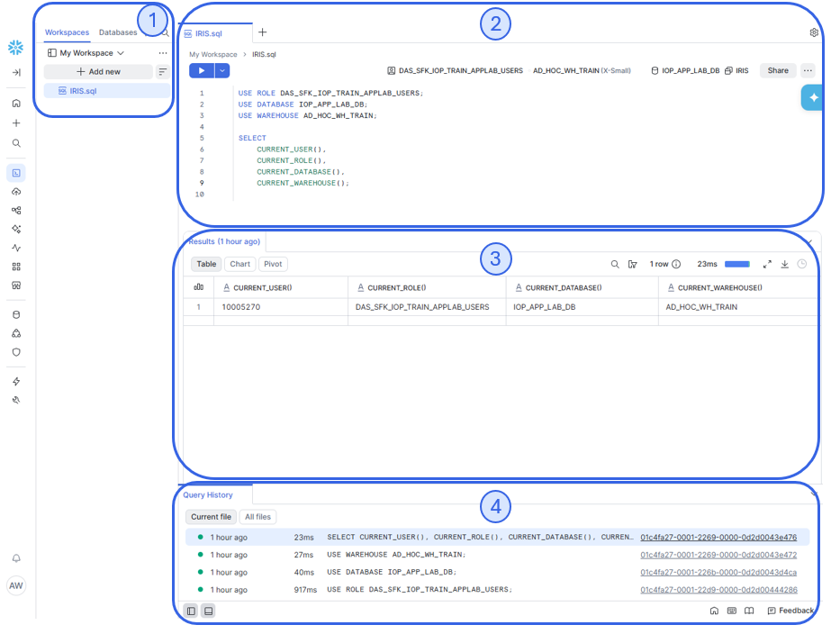

# Workspaces

Workspaces provides a unified editor for creating, organizing, and managing code across multiple file types that you can use to analyze data, develop models, and build pipelines.  A workspace is private to you and offers a development environment where you can build, experiment, and test your work. 

It is made up of 4 areas:

1. [Workspaces / Databases](#1-workspaces--databases)
2. [SQL Editor](#2-sql-editor)
3. [Results Panel](#3-results-panel)
4. [Query History](#4-query-history)

---

  
<strong>Workspace Interface Overview</strong>

  

    
  

---

## 1. Workspaces / Databases

- Central location for your files and folders.
- Drag and drop files between folders.
- Use nested folders to organize related worksheets.
- Each user has a default workspace named `My Workspace`.
- You can create additional workspaces using `+ Add New`.
- The default workspace cannot be renamed or deleted.
- Hierarchical view of all databases and objects in your account.
- Organized by database → schema → object type.
- Use the filter to quickly locate objects.
- Click `Filter` and then `Show databases I can query` to simplify the view.
- Use the ellipsis (...)  to:
  - Insert object names into the editor
  - Copy object names
  - View object definitions

---

## 2. SQL Editor

- Write and format SQL queries.
- Split panes to work on multiple files side-by-side.
- Use inline Copilot for suggestions and completions (if enabled).

---

## 3. Results Panel

- View query results directly below the editor.
- Split results side-by-side.
- Pin result sets for comparison.

---

## 4. Query History

- View all queries you have executed.
- `Current File` shows history for the active file only.
- `All Files` shows your full query history.
- Filter results by file or execution.
- Toggle using the `Query History icon` in the bottom toolbar.
