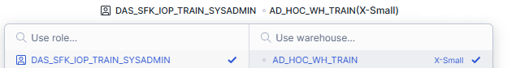

← [Back to Home →](README.md)

# Environment Setup

Before loading data or running queries, confirm your session context.

Snowflake operations are controlled by:

- Role
- Warehouse
- Database
- Schema

If these are not set correctly, queries may fail.

---

## Option B – Set Context Using SQL

Run the following statements:

```sql
USE ROLE DAS_SFK_IOP_TRAIN_SYSADMIN;
USE DATABASE IOP_APP_LAB_DB;
USE SCHEMA IRIS;
USE WAREHOUSE AD_HOC_WH_TRAIN;
```
### Confirm your context
```sql
SELECT
    CURRENT_USER(),
    CURRENT_ROLE(),
    CURRENT_DATABASE(),
    CURRENT_SCHEMA(),
    CURRENT_WAREHOUSE();
```

---
### Option A - Set Context Using User Interface

## Set Context Using the UI

<table>
  <tr>
    <td align="center">
      <strong>Change Role</strong><br><br>
      
    </td>
    <td align="center">
      <strong>Change Database & Warehouse</strong><br><br>
      
    </td>
  </tr>
</table>
